# rush



**The fast shell. Written in Rust.**

     

A feature-complete terminal shell compiled to a single binary. Feature clone of [rsh](https://github.com/isene/rsh) (Ruby Shell) rewritten in Rust for speed. Same workflow, same keybindings, 20x faster startup.

## Features

**Core Shell:**
- Command execution with pipes, redirects, background jobs, conditional operators
- Nick aliases (`:nick ls = ls --color -F`) with parametrized templates (`{{placeholder}}`)
- Global aliases (gnicks) for text substitution anywhere in command
- Abbreviations (fish-style): expand on space with visual feedback (`:abbrev`)
- Directory bookmarks with tags (`:bm work /projects #dev,daily`)
- Auto-cd into directories and bookmarks
- Tilde, variable, brace, and command substitution expansion
- Multi-line editing: continuation on `\`, `|`, `&&`, `||`, unclosed quotes

**Editing:**
- Full line editing with undo stack (Ctrl-_)
- Syntax highlighting through pipes (each segment colored independently)
- Right-arrow history suggestions (grayed inline preview)
- Auto-closing quotes and brackets (`"`, `'`, `(`, `[`, `{`)
- Ctrl-G to edit command in `$EDITOR`
- Ctrl-Y to copy line to clipboard
- Ctrl-R reverse incremental history search (like bash)
- Ctrl-A/E/K/U/W/L readline-compatible shortcuts

**Tab Completion:**
- Interactive cycling with LS_COLORS file coloring
- Selected item highlighted with reverse video
- TAB/S-TAB cycle forward/backward, Enter accepts, ESC cancels
- Command, file, directory, nick, bookmark, colon command completion
- Environment variable completion (`$PA<TAB>` -> `$PATH`)
- Smart subcommand completion (git, cargo, apt)
- Switch completion from `--help` parsing (cached)
- Completion learning (most-used ranked first)

**History:**
- Deduplication modes: off, full, smart
- Expansion: `!!` (last), `!-N` (Nth back), `!N` (by number)
- Shift-TAB interactive history search with fuzzy filtering
- Ctrl-R reverse incremental search (bash-style)
- Timestamps stored with each history entry

**Prompt:**
- Configurable colors for user, host, cwd, git branch, prompt character
- Directory-specific colors (pattern matching on path)
- Right-side prompt: git dirty/clean indicator, command duration (>1s)
- Window title updates via OSC escape
- Timestamp + expanded command display (configurable)

**Job Control:**
- Background jobs with `&`
- Ctrl-Z suspends foreground process
- `:jobs` lists all jobs with status
- `:fg N` resumes suspended job
- Automatic cleanup of finished jobs
- `$PIPESTATUS` tracking

**Directory Navigation:**
- `cd N` jumps to Nth entry from `:dirs` history
- `pushd`/`popd` directory stack
- `:dirs` / `:dirs -v` for numbered listing
- Auto-cd by typing directory name or bookmark

**Configuration:**
- JSON config (`~/.rushrc.json`) and state (`~/.rushstate.json`)
- 6 built-in themes: default, solarized, dracula, gruvbox, nord, monokai
- `:config key value` to change settings live
- `:import_rsh` to migrate nicks/bookmarks from existing `.rshrc`

**Sessions & Recording:**
- `:save_session` / `:load_session` for full state save/restore
- `:record start` / `:replay` for command sequence recording
- Session autosave (configurable interval)

**Safety:**
- Validation rules (`:validate rm -rf = confirm`)
- Auto-correct with Levenshtein distance suggestions
- Command-not-found package suggestions (via `command-not-found`)
- Slow command threshold alerts
- Nick recursion guard

**Integrations:**
- AI: `@ question` (chat) and `@@ task` (command suggestion) via OpenAI
- Calculator: `:calc 2**10 + sqrt(144)`
- xrpn: `= expr` pipes to HP-41 RPN calculator
- fzf: `f` for fuzzy file finding
- File manager: `r` launches configurable file manager
- Login shell support (`--login` / `-l`)

## Installation

### From source

```bash
git clone https://github.com/isene/rush
cd rush
PATH="/usr/bin:$PATH" cargo build --release
cp target/release/rush ~/bin/
```

### Binary size

| Build | Size | Startup |
|-------|------|---------|
| Release | 2.5 MB | ~26ms |

## Usage

```bash
rush                    # Interactive shell
rush -c "echo hello"    # Run command and exit
rush --login            # Login shell (sources profile files)
```

## Keybindings

| Key | Action |
|-----|--------|
| Tab | Complete (interactive cycling with LS_COLORS) |
| Shift-Tab | History search (fuzzy filter) |
| Ctrl-R | Reverse incremental history search |
| Ctrl-G | Edit line in $EDITOR |
| Ctrl-Y | Copy line to clipboard |
| Ctrl-_ | Undo last edit |
| Ctrl-Z | Suspend foreground process |
| Ctrl-C | Clear line |
| Ctrl-D | Exit (empty line) |
| Ctrl-L | Clear screen |
| Ctrl-A / Ctrl-E | Beginning / end of line |
| Ctrl-K / Ctrl-U | Kill to end / beginning |
| Ctrl-W | Delete word backward |
| Up / Down | History navigation |
| Right | Accept history suggestion |

## Commands

| Command | Action |
|---------|--------|
| `:nick [name = val]` | Aliases |
| `:gnick [name = val]` | Global aliases |
| `:abbrev [name = val]` | Abbreviations (expand on space) |
| `:bm [name [path] [#tags]]` | Bookmarks |
| `pushd [dir]` / `popd` | Directory stack |
| `:dirs [-v]` | Directory history |
| `:history [n]` | Command history (with timestamps) |
| `:theme [name]` | Color theme |
| `:calc expr` | Calculator |
| `= expr` | xrpn RPN calculator |
| `:stats` | Command statistics |
| `:jobs` / `:fg N` | Job control |
| `:env [set/unset]` | Environment variables |
| `:config [key val]` | Settings |
| `:validate [pat = action]` | Safety rules |
| `:save_session name` | Save state |
| `:record start/stop` | Record commands |
| `:replay name` | Replay recording |
| `:import_rsh` | Import from ~/.rshrc |
| `:rehash` | Rebuild command cache |
| `:version` / `:info` | Version and features |
| `:help` | Command reference |

## Configuration

All settings in `~/.rushrc.json`:

```json
{
  "nick": { "ls": "ls --color -F" },
  "abbrev": { "gst": "git status" },
  "c_user": 2, "c_host": 2, "c_cwd": 81,
  "c_prompt": 208, "c_cmd": 48,
  "dir_colors": [["MyProject", 172]],
  "show_cmd": true, "auto_correct": true,
  "rprompt": true, "auto_pair": true,
  "completion_fuzzy": true, "completion_limit": 10,
  "slow_command_threshold": 10,
  "file_manager": "rtfm"
}
```

## Comparison with rsh

| | rsh (Ruby) | rush (Rust) |
|---|---|---|
| Startup | ~300ms | ~26ms |
| Binary | Ruby runtime | 2.5MB standalone |
| Config | Ruby eval (.rshrc) | JSON (.rushrc.json) |
| Plugins | Ruby files | N/A |
| Features | 76 | 89 |

Rush has more features than rsh: Ctrl-R search, abbreviations, auto-pair, undo, multi-line editing, right prompt, pushd/popd, $PIPESTATUS, and command-not-found suggestions.

## Part of the Rust Terminal Suite

| Tool | Clones | Status |
|------|--------|--------|
| **rush** | [rsh](https://github.com/isene/rsh) | Active |
| [crust](https://github.com/isene/crust) | [rcurses](https://github.com/isene/rcurses) | Planned |
| [kastrup](https://github.com/isene/kastrup) | [Heathrow](https://github.com/isene/heathrow) | Planned |
| [tock](https://github.com/isene/tock) | [Timely](https://github.com/isene/timely) | Planned |
| [scroll](https://github.com/isene/scroll) | [brrowser](https://github.com/isene/brrowser) | Planned |
| [pointer](https://github.com/isene/pointer) | [RTFM](https://github.com/isene/RTFM) | Planned |

## License

[Unlicense](https://unlicense.org/) - public domain.

## Credits

Created by Geir Isene (https://isene.org) with extensive pair-programming with Claude Code.
